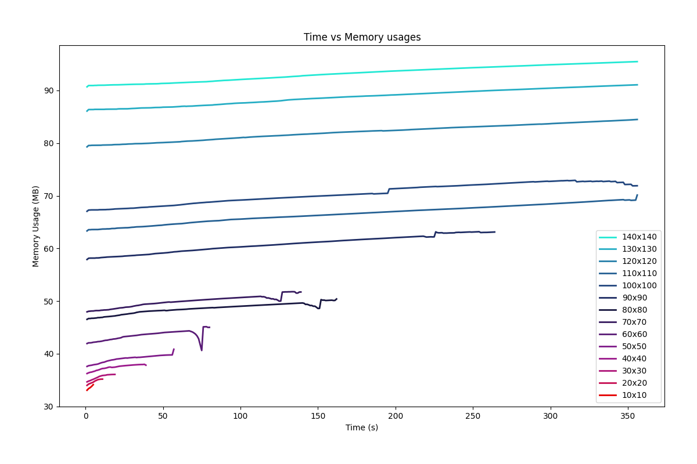

# aTLAS Evaluation Result Utility


## Prerequisites
- Python 3.9+
- Pip 21+
- Setuptools 56+

Use below command(s) to determine if your environment meets the prerequisites
```bash
python -V                       # Python version
python -m pip -V                # Pip version
python -m pip show setuptools   # Setuptools version
```


## Install
Follow one of the following steps to install `atlas-evalutil` utility
> It is recommended to install inside a **virtual environment**

Install from `wheel`. From terminal enter:
```bash
pip install <file-name>.whl
```
Install from `sdist`. From terminal enter:
```bash
pip install <file-name>.tar.gz
```
Install from the project directory. Navigate to project directory where `setup.py` is located and enter:
```bash
pip install .
```


## Run
After successful installation `atlas-evalutil` command should be available globally from terminal.
```bash
atlas-evalutil
```
> Make sure the `bin` or `Scripts` directory of your python installation is included in path environment variable unless you are using any virtual environment.

Alternatively, can be executed as a python module
```bash
python -m atlas.evalutil
```


## Inputs
An input directory is expected to contain the required input items listed below:
- directories: `evaluator_results`
- files: `scenario_sizes.csv`

Also, the input directory can be organized into directories as v0, v1, v2 etc. to specify multiple version of evaluation results. In such case the name of the sub directories within input directory must start with `v` followed by a `number`.

Example directory structures are provided below:
~~~
input
|___ evaluator_results
|    |___ sr_20230107_222428_160.py
|    |___ sr_20230107_222438_049.py
|    ...
|
|___ scenario_sizes.csv
~~~
or,
~~~
input
|___ v0
|    |___ evaluator_results
|    |    |___ sr_20230107_222428_160.py
|    |    |___ sr_20230107_222438_049.py
|    |    ...
|    |
|    |___ scenario_sizes.csv
|
|___ v1
|    |___ evaluator_results
|    |    |___ sr_20230107_222533_196.py
|    |    |___ sr_20230109_003206_619.py
|    |    ...
|    |
|    |___ scenario_sizes.csv
|
|___ ...
~~~


## Outputs
When `--export` option is specified, the output is stored at default output directory or directory specified through `--output-dir` option. See [scenario](#scenario) or [chart](#chart) options for more information. A typical directory structure is as follows:
~~~
output
|___ memory_usage.svg
|___ time_usage.svg
|___ scenarios.txt
~~~
or,
~~~
output
|___ v0
|    |___ memory_usage.svg
|    |___ time_usage.svg
|    |___ scenario.txt
|
|___ v1
|    |___ memory_usage.svg
|    |___ time_usage.svg
|    |___ scenarios.txt
|
|___ ...
~~~


## Commands
This section documents all the available commands and options of `atlas-evalutil`.

Calling `atlas-evalutil` from the command-line also displays the complete list of commands. You can combine `--help` with any of the commands for more formation.

### Global options
- `--help (-h)`: Displays help information.
- `--config-file (-c)`: Custom configuration file (TOML) to override configurations for the session

Here are some use cases. Please refer below for more detail on the sub command(s).
```bash
atlas-evalutil scenario
atlas-evalutil chart --time-usage
atlas-evalutil chart --memory-usage
```
Supplying custom config file
```bash
atlas-evalutil --config-file ./config.toml scenario
atlas-evalutil --config-file ./config.toml chart --time-usage
atlas-evalutil --config-file ./config.toml chart --memory-usage
```


### scenario
The `scenario` command displays the list of scenarios ran for evaluation.
```bash
atlas-evalutil scenario
```
You can optionally save the output into output directory using `--export` option.
```bash
atlas-evalutil scenario --export
```
#### Options
- `--help (-h)`: Displays help information.
- `--input-version (-v)`: Not needed if an input directory contains the required input items directly. However the input directory can have multiple version of evaluation data organized into directories as v0, v1, v2 etc. ([see input directory structure](#inputs)). In such a scenario this option is required to specify the version of input data to be selected.
- `--input-dir (-i)`: Sets the path of input directory (default: data/input). If `--input-version` is specified then a sub directory with the version name is expected inside the input directory.
- `--output-dir (-o)`: Sets the path of the output directory used by `--export` option (default: data/output). If `--input-version` is specified then a sub directory with the version name is created.
- `--export (-e)`: Saves the list of scenario names in output directory as text file


### chart
The `chart` command displays and/or save a desired chart. Currently two types of charts are implemented which can be switched by `--time-usage` and `--memory-usage` options.

For example the following command displays the memory usage chart
```bash
atlas-evalutil chart --memory-usage
```


The following command displays the time usage chart
```bash
atlas-evalutil chart --time-usage
```


You can optionally save the output into output directory using `--export` options.
```bash
atlas-evalutil chart --time-usage --export
```
You can specify the output format using `--export-format` option. Supported formats are `jpg`, `png`, `svg`, `pdf`. The default format is `svg`
```bash
atlas-evalutil scenario --export --export-format "pdf"
```
You can also specify the necessary axis units through optional `--memory-unit` and/or `--time-unit` options. Default memory unit is in `Megabytes` and time unit is in `seconds`
```bash
atlas-evalutil chart --time-usage --time-unit "m"
atlas-evalutil chart --time-usage --memory-unit "GB"
atlas-evalutil chart --time-usage --time-unit "m" --memory-unit "GB"

atlas-evalutil chart --memory-usage --time-unit "m"
atlas-evalutil chart --memory-usage --memory-unit "GB"
atlas-evalutil chart --memory-usage --time-unit "m" --memory-unit "GB"
```
A combination of options is also possible 
```bash
atlas-evalutil chart --memory-usage --time-unit "m" --memory-unit "GB" --export
atlas-evalutil chart --memory-usage --time-unit "m" --memory-unit "GB" --export --export-format "pdf"
```
#### Options
- `--help (-h)`: Displays help information.
- `--input-version (-v)`: Not needed if an input directory contains the required input items directly. However the input directory can have multiple version of evaluation data organized into directories as v0, v1, v2 etc. ([see input directory structure](#inputs)). In such a scenario this option is required to specify the version of input data to be selected.
- `--input-dir (-i)`: Sets the path of input directory (default: data/input). If `--input-version` is specified then a sub directory with the version name is expected inside the input directory.
- `--output-dir (-o)`: Sets the path of the output directory used by `--export` option (default: data/output). If `--input-version` is specified then a sub directory with the version name is created.
- `--time-usage (-t)`: Displays the time usage chart
- `--memory-usage (-m)`: Displays the memory usage chart
- `--time-unit (-tu)`: Sets time unit for relevant axis of the desired chart. See help for possible options.
- `--memory-unit (-mu)`: Sets memory unit for relevant axis of the desired chart. See help for possible options.
- `--export (-e)`: Saves the chart as a SVG file in output directory
- `--export-format (-f)`: Format of exported chart. See help for possible options.
- `--chart-type (-ct)`: Specifies the type of the chart to generate. Currently supported `line` and `scatter`. Default is `line`
- `--x-limit (-xl)`: Limit of x-axis in format of `min,max` (example: 0,100). Helpful for localization.
- `--y-limit (-yl)` Limit of y-axis in format of `min,max` (example: 0,100). Helpful for localization. (for memory usage only)
- `--x-scaled (-xs)`: Scale x-axis (time) to percentage (for memory usage only)


### config
The `config` command can be used to access, set and/or reset configuration items.
```bash
atlas-evalutil config --list
atlas-evalutil config --set input_dir="data/input"
atlas-evalutil config --set input_dir="data/input" output_dir="data/output"
atlas-evalutil config --get input_dir
atlas-evalutil config --reset input_dir
```
#### Options
- `--help (-h)`: Displays help information.
- `--list (-l)`: Display list of all configurations
- `--get (-g)`:  Displays a specific config item
- `--set (-s)`: Sets the config item(s). Expected argument(s) in `key=value` format
- `--reset (-r)`: Resets the config item with the item specified in active config file

By default the configuration items are stored at `atlas-evalutil.toml` inside installation directory. The configurations can be overridden at user level by placing `atlas-evalutil.toml` file in user home directory. A further overriding is possible by placing another `atlas-evalutil.toml` file at working directory. Finally, it is also possible to override all of them using the global option `--config-file` option.


## Further Development
Refer to [README.dev.md](./README.dev.md) for further instruction to extend the project.